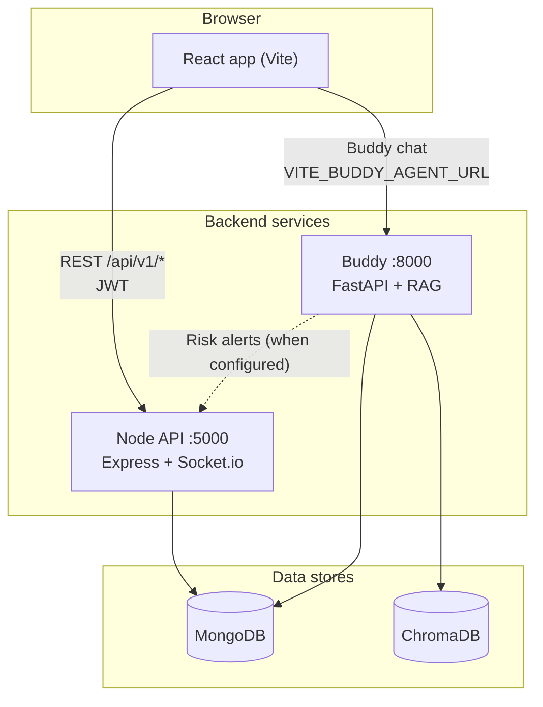
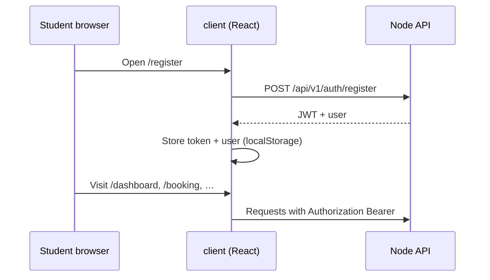
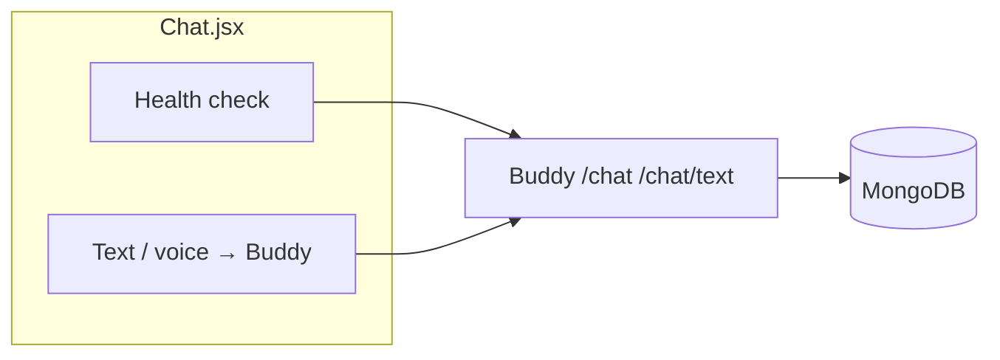
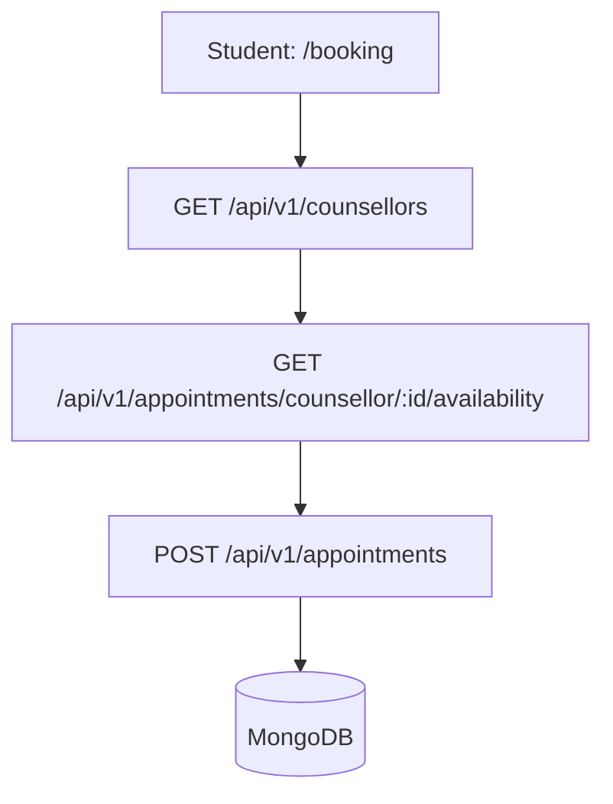
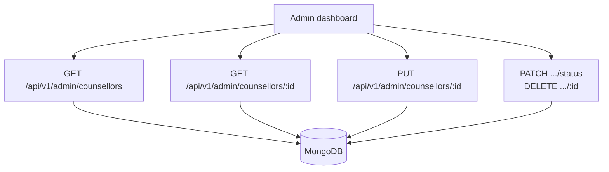

# Mann-Mitra

Mann-Mitra is a **mental health support platform** for institutions. It combines a **React** web app, a **Node.js** API (MongoDB, Socket.io, audits, rate limits), and an optional **Buddy** FastAPI service for **RAG-based chat**, risk scoring, and crisis-related signals.

---

## What is in this repository

| Part | Technology | Who it serves |
|------|------------|----------------|
| **`client/`** | React 19, Vite, Tailwind | **Students** (main UX), **counsellors**, **admins**; public pages (home, about, logins) |
| **`server/`** | Express 5, Mongoose, Socket.io | Auth, bookings, forum, screenings, admin APIs, chat HTTP API, real-time |
| **`buddy/`** | FastAPI, ChromaDB, optional Gemini | AI chat (`/chat`, `/chat/text`), RAG, decision engine, Mongo session storage |

Shared data lives in **MongoDB** (users, appointments, forum, screenings, chat sessions, etc.). **ChromaDB** is used by Buddy for vector search over the knowledge base.

---

## Roles and responsibilities

| Role | Typical tasks | Primary UI |
|------|----------------|------------|
| **Student** | Screening (PHQ-9 / GAD-7), AI chat (Buddy), book counsellors, forum, resources, certification paths | `/dashboard`, `/screening`, `/chat`, `/booking`, `/forum`, … |
| **Counsellor** | Login, dashboard, appointments, live chat platform (with students) | `/counsellor/login` → `/counsellor/dashboard`, `/chat-platform` |
| **Admin** | Org signup/login, executive dashboard, counsellor CRUD, analytics/crisis tabs | `/admin/signup`, `/admin/login` → `/admin/dashboard` |
| **Moderator** | Forum moderation (where implemented) | `/moderator` |

Auth is **JWT-based**. The client stores tokens under `Mann-Mitra_token` and/or `token`, and user JSON under `user` / `Mann-Mitra_user` (see `client/src/utils/routeAuth.js`).

---

## System architecture (high level)



---

## End-to-end flows

### A. Student registration and session



### B. AI chat (Buddy-first, as used by the Chat page)

The **`/chat`** page primarily talks to **Buddy** for responses (`POST /chat` or `POST /chat/text`), after checking `GET {BUDDY_URL}/health`. Buddy can persist sessions in **MongoDB** and may notify the Node server on elevated risk (see `buddy/README.md`).



The Node API also exposes **`POST /api/v1/chat/message`** (optional auth, safety checks, `llm.service`) for an alternative or supplementary path—useful for integrations that do not call Buddy directly.

### C. Booking a counsellor



### D. Admin manages counsellors



---

## Quick start (local development)

### 1. MongoDB

Run MongoDB locally or use Atlas. You need a URI for both **server** and (if you use Buddy) **buddy**.

### 2. Node API

```bash
cd server
cp .env.example .env
# Set MONGO_URI, JWT_SECRET, CLIENT_URL, etc.
npm install
npm run dev
```

- Health: `GET http://localhost:5000/health`  
- API prefix: `/api/v1/...` (plus some **legacy** mounts under `/api/...`)

### 3. Frontend

```bash
cd client
cp .env.example .env
# VITE_API_URL=http://localhost:5000/api  (or http://localhost:5000 — see client README)
# VITE_BUDDY_AGENT_URL=http://localhost:8000
npm install
npm run dev
```

Default UI: **http://localhost:3000** (Vite proxies `/api` → port 5000 in dev).

### 4. Buddy (optional, for full AI chat)

```bash
cd buddy
# Python venv, pip install, .env with MONGO_URI, Chroma, GEMINI, etc.
# See buddy/README.md
```

Default Buddy: **http://localhost:8000**

---

## Default ports

| Service | Port |
|---------|------|
| React (Vite) | 3000 |
| Node API | 5000 |
| Buddy (FastAPI) | 8000 |

---

## Documentation map

| Document | Contents |
|----------|----------|
| **[client/README.md](client/README.md)** | All **routes/pages** by role, auth wrappers, env vars, how UI calls Node vs Buddy |
| **[server/README.md](server/README.md)** | Full **REST** surface: auth, appointments, counsellors, forum, screening, chat, admin |
| **[buddy/README.md](buddy/README.md)** | RAG pipeline, risk/decision engine, env vars, ingestion, deployment |

---

## Security

- Do **not** commit `.env` files or production secrets.  
- JWTs must use a strong `JWT_SECRET`.  
- This platform handles **sensitive mental health data**; follow your institution’s privacy and retention policies.

---

## License

Refer to the repository’s license file if present; otherwise treat usage as defined by your organization.
