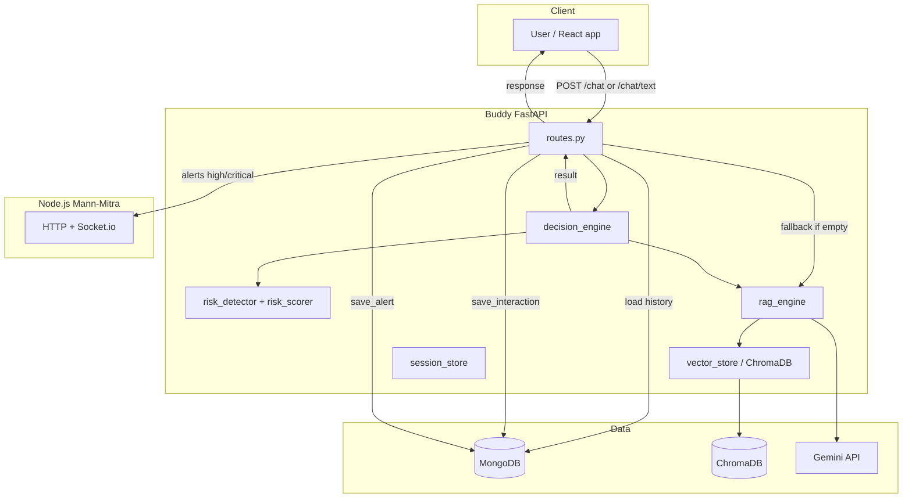
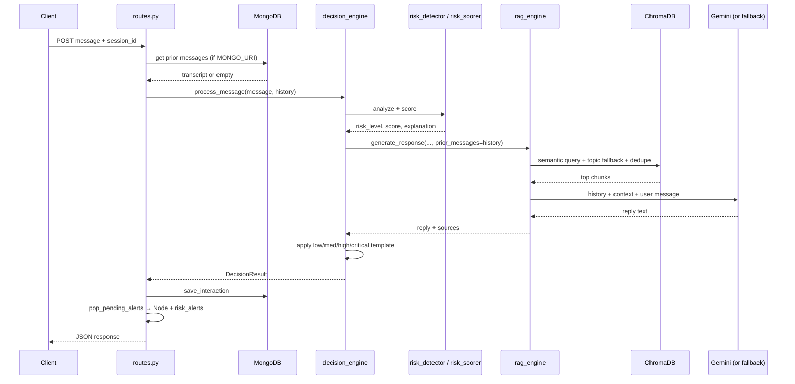
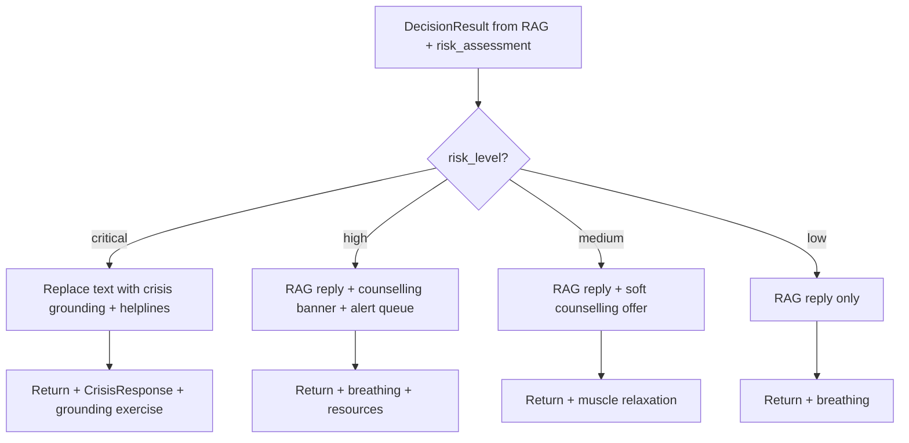
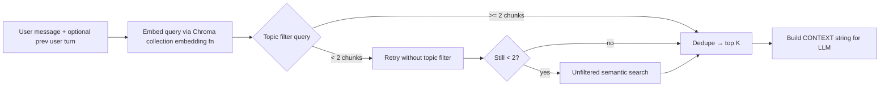
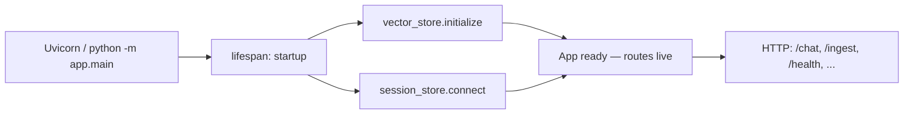
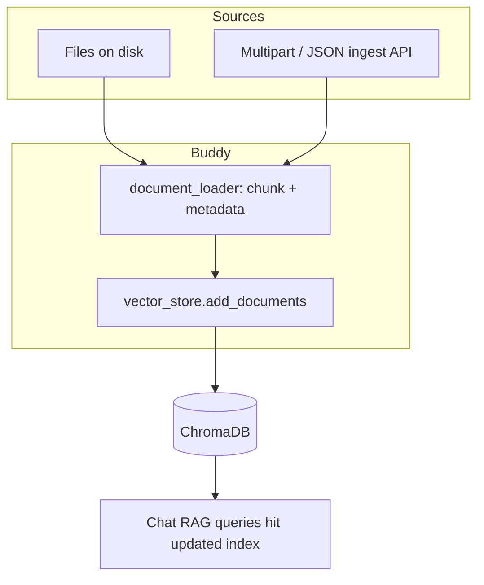

# Buddy — RAG Mental Health Chatbot Service

A FastAPI-based microservice that powers the Mann-Mitra mental health chatbot with **Retrieval-Augmented Generation (RAG)**, **risk detection**, **counsellor recommendations**, and **admin crisis alerts**.

This README explains **the full runtime flow**, **where each piece of logic lives**, and **workflow diagrams** so a new developer or reviewer can understand the system end to end.

---

## Table of contents

1. [System overview](#system-overview)
2. [End-to-end chat flow (what happens per message)](#end-to-end-chat-flow-what-happens-per-message)
3. [Workflow design (diagrams)](#workflow-design-diagrams)
4. [RAG pipeline (retrieval + generation)](#rag-pipeline-retrieval--generation)
5. [Risk pipeline](#risk-pipeline)
6. [Decision engine outputs](#decision-engine-routing)
7. [Persistence, sessions, and memory](#persistence-sessions-and-memory)
8. [Component map (files → responsibility)](#component-map-files--responsibility)
9. [Tech stack](#tech-stack)
10. [Application startup](#application-startup-appmainpy)
11. [Knowledge ingestion workflow](#knowledge-ingestion-workflow)
12. [Folder structure, setup, API, integration](#folder-structure) (existing sections below)

---

## System overview

Buddy sits between the **React client** and **shared backend infrastructure**:

- **ChromaDB** stores embedded chunks of a mental health knowledge base (RAG).
- **MongoDB** stores chat sessions, messages, risk snapshots, and alert records (same DB as the Node.js Mann-Mitra server).
- **Google Gemini** generates replies when configured; otherwise a **rule-based fallback** answers from heuristics.
- **Node.js** receives HTTP alerts for high/critical risk and can broadcast to counsellors via Socket.io.

The service is **stateless across restarts for conversation content**: transcript continuity is loaded from **MongoDB** on each request when `MONGO_URI` is set. In-process memory in `rag_engine` is a cache for the current process and is **re-seeded** from Mongo when history exists.

### Who should read what

| Role | Where to start |
|------|----------------|
| New **backend** developer | [End-to-end chat flow](#end-to-end-chat-flow-what-happens-per-message), [Workflow design](#workflow-design-diagrams), [Component map](#component-map-files--responsibility) |
| **DevOps** / deploy | [Application startup](#application-startup-appmainpy), [Environment variables](#environment-variables-reference), [Setup & installation](#setup--installation), `GET /health` |
| **Content** / knowledge | [Knowledge ingestion workflow](#knowledge-ingestion-workflow), [RAG pipeline](#rag-pipeline-retrieval--generation), [Adding knowledge base documents](#adding-knowledge-base-documents) |
| **Frontend** | [Frontend integration](#frontend-integration), [API endpoints](#api-endpoints) (`/chat`, `/chat/text`) |

---

## End-to-end chat flow (what happens per message)

The following applies to **`POST /chat`** and **`POST /chat/text`** (same core logic; response shape differs).

### Step 1 — HTTP entry (`app/api/routes.py`)

1. Resolve **`session_id`**: use the client-provided id, or generate a new one (`session_…` or `text_session_…`).
2. **Load conversation history** via `_conversation_history_for_session(session_id)`:
   - If **`MONGO_URI`** is set, read `chat_sessions.messages` for that session, normalize to `{role, content}` (user/assistant only), cap length with **`MAX_HISTORY_LENGTH`**.
   - If Mongo returns nothing or errors, fall back to **`rag_engine`** in-memory messages for that session.
3. Call **`decision_engine.process_message(..., conversation_history=history)`**.

### Step 2 — Risk assessment (`app/services/decision_engine.py` → `risk_detector` + `risk_scorer`)

1. **`risk_detector.analyze(message, history)`** — keyword dictionaries (including Hinglish variants), emotional amplifiers, repetition across the thread, and historical trend signals. Produces **`RiskIndicators`**.
2. **`risk_scorer.score(indicators)`** — weighted blend → **score 0–100** and **`RiskLevel`**: low / medium / high / critical (thresholds from `.env`).
3. **`_detect_topic_hint(message)`** — lightweight keyword→topic mapping (e.g. anxiety, stress, crisis) used only to **bias vector search**, not to replace clinical risk logic.

### Step 3 — RAG generation (`app/services/rag_engine.py`)

1. **`seed_session_history(session_id, prior_messages)`** — align in-process history with the transcript passed from the route (typically from Mongo).
2. **Build retrieval query text** — current user message plus, when useful, the **previous user turn** (helps short follow-ups like “what else can I do?”).
3. **`vector_store.query(...)`**:
   - Optional **`topic` metadata filter** from the topic hint.
   - **`allow_topic_fallback`**: if too few chunks match the topic filter (many chunks are tagged `general`), **retry without topic** so semantic search still returns useful context.
   - **Does not** filter Chroma rows by “user risk level”: chunk `severity_category` describes *document content*, not the live user; filtering on it used to starve retrieval.
   - Fetch a **larger candidate pool** (`≈ 2 × RAG_TOP_K`, capped), then **dedupe** near-identical chunks and keep **`RAG_TOP_K`** for the prompt.
4. Format chunks into **CONTEXT** blocks (source, topic, text).
5. **`_call_gemini`** (if `GEMINI_API_KEY` set): system instruction + context + **recent history** as Gemini contents + current user message. **`prior_messages`** ensures the model sees the same thread as risk detection. On failure or missing key, **`_fallback_response`** (rule-based).
6. **`_update_history`** — append user + assistant turns in memory (trimmed to **`MAX_HISTORY_LENGTH`**).

### Step 4 — Decision routing (`decision_engine`)

| Risk | Response text | Extras |
|------|----------------|--------|
| **Critical** | Fixed **crisis** grounding + helplines (RAG reply is **not** shown) | Coping card (grounding), counsellor recommendation, **`CrisisResponse`**, pending **admin alert** |
| **High** | RAG text + **strong** counselling paragraph | Breathing exercise, counsellor recommendation, helpline resources, pending **admin alert** |
| **Medium** | RAG text + optional counselling line | Muscle relaxation exercise, counsellor recommendation |
| **Low** | RAG text as-is | Breathing exercise, self-help oriented actions |

### Step 5 — After `process_message` returns (routes again)

1. **`session_store.save_interaction`** — upsert `chat_sessions`: push user + assistant messages, mood/risk fields, timestamps.
2. **`pop_pending_alerts()`** — for each alert: **`POST`** to Node (`buddy-alert` path used in code), **`save_alert`** to `risk_alerts`.
3. Return **JSON** to the client (`ChatResponse` or simplified `/chat/text` payload).

---

## Workflow design (diagrams)

### High-level request journey



### Sequence: single chat message



### Decision engine branching



### RAG retrieval internals (conceptual)



---

## Application startup (`app/main.py`)

When Uvicorn loads the app, the **lifespan** handler runs before requests are served:

1. **`vector_store.initialize()`** — Opens the persistent Chroma client, selects the embedding backend (Gemini vs local SentenceTransformer per `EMBEDDING_BACKEND` / `GEMINI_API_KEY`), and opens the collection `CHROMA_COLLECTION_NAME`.
2. **`session_store.connect()`** — If `MONGO_URI` is set, connects with Motor and ensures indexes on `chat_sessions` and `risk_alerts`. If the URI is empty, Buddy runs **without** Mongo persistence (history load/save no-ops).

On shutdown, the lifespan exits and **`session_store.close()`** runs.



---

## Knowledge ingestion workflow

New documents become searchable chunks through the same **loader → Chroma** path, whether you seed offline or call the HTTP API.

| Path | Entry point | Flow |
|------|----------------|------|
| **Offline** | `seed_knowledge_base.py` | Scan `knowledge_base/` (e.g. `sample_documents/`) → `document_loader` → `vector_store.add_documents` |
| **Online** | `POST /ingest/text`, `/ingest/pdf`, `/ingest/directory` | `routes.py` invokes `document_loader` + `vector_store.add_documents` |

`document_loader` splits text into overlapping chunks, assigns **`topic`** and **`severity_category`** metadata heuristically, then the vector store embeds each chunk with the **same** embedding function used at query time.



**Operational note:** Changing embedding backend or model after data was indexed requires **re-ingesting** (or re-running `seed_knowledge_base.py`) so vectors stay consistent.

---

## RAG pipeline (retrieval + generation)

| Stage | Implementation | Notes |
|-------|----------------|--------|
| Ingestion | `document_loader.py` | Chunks PDF/text; assigns `topic`, `severity_category` per chunk heuristics |
| Storage | `vector_store.py` | Persistent Chroma; embedding = Gemini or **SentenceTransformer** (`all-MiniLM-L6-v2`) per `EMBEDDING_BACKEND` |
| Query | `vector_store.query` | Cosine similarity; optional metadata `where`; **topic fallback** for chat |
| Prompt | `rag_engine.SYSTEM_PROMPT` | Safety + grounding rules + tone |
| Generation | `rag_engine._call_gemini` | `system_instruction` + context + **turn history** + user message |

**Important:** Query and index **must use the same embedding backend**. If you change `EMBEDDING_BACKEND` or re-seed with a different embedder, **re-run ingestion** for consistent retrieval.

---

## Risk pipeline

Detailed scoring tables and formulas are in the sections [Risk Detection Pipeline](#risk-detection-pipeline) and [Decision Engine Routing](#decision-engine-routing) below.

Conceptually: **detector** extracts signals → **scorer** maps to 0–100 and a **level** → **decision_engine** chooses UI fields and whether to **queue an admin alert** for Node.

---

## Persistence, sessions, and memory

| Store | Collection / key | Contents |
|-------|------------------|----------|
| MongoDB | `chat_sessions` | `session_id`, `messages[]` (user/assistant entries, timestamps), `risk_score`, `risk_level`, `mood_scores`, etc. |
| MongoDB | `risk_alerts` | Serialized alert payloads after high/critical flows |
| ChromaDB | Collection `CHROMA_COLLECTION_NAME` | Embedded chunk documents + metadata |
| Process RAM | `rag_engine._conversations` | Last N messages per session; **overwritten** from Mongo when history is loaded |

**`DELETE /chat/sessions/{session_id}`** clears **in-memory** RAG state only; it does **not** delete Mongo documents unless you add that behavior elsewhere.

---

## Component map (files → responsibility)

| File | Role in the flow |
|------|------------------|
| `app/main.py` | FastAPI app, CORS, lifespan: init **vector_store**, **session_store.connect** |
| `app/config.py` | All `.env` settings (`pydantic-settings`) |
| `app/api/routes.py` | HTTP layer: history load, `process_message`, Mongo save, alert HTTP to Node |
| `app/services/decision_engine.py` | Orchestrates risk → RAG → branch by level; builds `DecisionResult` |
| `app/services/rag_engine.py` | Retrieval query construction, Chroma query, dedupe, Gemini/fallback, session message buffer |
| `app/services/vector_store.py` | Chroma client, embeddings, `query` + topic fallback |
| `app/services/risk_detector.py` | Keyword / language / history signals |
| `app/services/risk_scorer.py` | Score aggregation and level |
| `app/services/session_store.py` | Motor async Mongo access; `get_chat_history_turns`, `save_interaction`, alerts |
| `app/services/document_loader.py` | Chunking + metadata for ingest |
| `app/models/schemas.py` | Pydantic API and domain models |
| `seed_knowledge_base.py` | Offline script to load `knowledge_base/` into Chroma |

---

## Tech Stack

| Component | Technology |
|-----------|-----------|
| Framework | FastAPI + Uvicorn |
| Vector DB | ChromaDB (persistent, cosine similarity) |
| Embeddings | Google Gemini (`EMBEDDING_MODEL`, default `gemini-embedding-001`) **or** SentenceTransformers `all-MiniLM-L6-v2` via `EMBEDDING_BACKEND` (`auto` / `gemini` / `local`) |
| LLM | Google Gemini (`GEMINI_MODEL`, default `gemini-2.0-flash`), with rule-based fallback |
| Database | MongoDB (Motor async) — shared with Node.js server |
| Document ingestion | PyPDF + LangChain text splitters |
| Risk detection | Custom NLP keyword classifier with weighted scoring |

---

## Folder Structure

```
buddy/
├── app/
│   ├── __init__.py
│   ├── main.py                    # FastAPI entry point, lifespan, CORS
│   ├── config.py                  # Pydantic settings from .env
│   │
│   ├── models/
│   │   ├── __init__.py
│   │   └── schemas.py             # All Pydantic request/response models
│   │
│   ├── services/
│   │   ├── __init__.py
│   │   ├── document_loader.py     # PDF/text ingestion + chunking + metadata
│   │   ├── vector_store.py        # ChromaDB integration (store & query)
│   │   ├── rag_engine.py          # RAG pipeline (retrieve → context → Gemini)
│   │   ├── risk_detector.py       # NLP risk detection (keywords + weights)
│   │   ├── risk_scorer.py         # Weighted risk score calculation (0-100)
│   │   ├── decision_engine.py     # Routes response by risk level
│   │   └── session_store.py       # MongoDB persistence (sessions, alerts)
│   │
│   └── api/
│       ├── __init__.py
│       └── routes.py              # All API endpoints
│
├── knowledge_base/
│   └── sample_documents/          # Pre-loaded mental health resources
│       ├── anxiety_management.txt
│       ├── cbt_guide.txt
│       ├── crisis_intervention.txt
│       ├── depression_awareness.txt
│       └── stress_management.txt
│
├── seed_knowledge_base.py         # One-time script to populate ChromaDB
├── requirements.txt
├── .env                           # Local config (not committed)
├── .env.example                   # Template for environment variables
├── .gitignore
└── README.md
```

---

## Setup & Installation

### Prerequisites

- Python 3.10+
- MongoDB instance (the same one used by the Node.js server)
- Google Gemini API key (free at [aistudio.google.com/apikey](https://aistudio.google.com/apikey))

### 1. Create virtual environment

```bash
cd buddy
python -m venv venv

# Windows
venv\Scripts\activate

# macOS/Linux
source venv/bin/activate
```

### 2. Install dependencies

```bash
pip install -r requirements.txt
```

### 3. Configure environment

Copy `.env.example` to `.env` and fill in your values:

```bash
cp .env.example .env
```

Key settings:

| Variable | Required | Description |
|----------|----------|-------------|
| `MONGO_URI` | Yes | MongoDB connection string (same as Node.js server) |
| `GEMINI_API_KEY` | No | Google Gemini API key (free tier: 15 req/min, 1M tokens/day). Without it, rule-based fallback is used |
| `NODE_SERVER_URL` | Yes | Node.js server URL for forwarding crisis alerts via Socket.io |
| `CHROMA_PERSIST_DIR` | No | Where ChromaDB stores data (default: `./chroma_db`) |

### 4. Seed the knowledge base

Run once to load sample mental health documents into ChromaDB:

```bash
python seed_knowledge_base.py
```

This will:
- Read all `.txt` and `.pdf` files from `knowledge_base/sample_documents/`
- Chunk them into 500-token segments with 50-token overlap
- Auto-tag each chunk with topic and severity metadata
- Store embeddings in ChromaDB (using Gemini embeddings or SentenceTransformers)

### 5. Start the service

```bash
# Development (with auto-reload)
uvicorn app.main:app --reload --host 0.0.0.0 --port 8000

# Or directly
python -m app.main
```

The service starts at `http://localhost:8000`. Visit `http://localhost:8000/docs` for interactive Swagger API docs.

---

## API Endpoints

Behavioral details for chat (history load, RAG, risk, Mongo, alerts) are documented in [End-to-end chat flow](#end-to-end-chat-flow-what-happens-per-message) and [Workflow design](#workflow-design-diagrams).

### Chat

| Method | Endpoint | Description |
|--------|----------|-------------|
| `POST` | `/chat` | Full RAG chat — returns structured response with risk assessment, counsellor recommendation, coping exercises |
| `POST` | `/chat/text` | Simplified text endpoint — matches existing Buddy agent interface used by the React frontend |
| `GET` | `/chat/history/{session_id}` | Get conversation history with mood scores |
| `DELETE` | `/chat/sessions/{session_id}` | Clear a session |

**Example — POST /chat/text:**

```json
// Request
{
  "message": "I've been feeling really anxious about my exams",
  "session_id": "session_abc123"
}

// Response
{
  "text": "I understand you're feeling anxious about exams...",
  "session_id": "session_abc123",
  "risk_level": "medium",
  "risk_score": 35,
  "suggested_actions": ["optional_counselling", "coping_strategies", "breathing_exercise"],
  "counsellor_recommendation": {
    "recommended": true,
    "urgency": "moderate",
    "session_type": "chat",
    "message": "Talking to a counselor could be helpful..."
  },
  "coping_exercise": {
    "type": "relaxation",
    "title": "Progressive Muscle Relaxation",
    "instructions": ["..."],
    "duration": "10-15 minutes"
  }
}
```

### Knowledge Base

| Method | Endpoint | Description |
|--------|----------|-------------|
| `POST` | `/ingest/text` | Ingest a text document into the knowledge base |
| `POST` | `/ingest/pdf` | Upload and ingest a PDF file |
| `POST` | `/ingest/directory` | Bulk ingest all files from a directory |
| `GET` | `/knowledge-base/stats` | Get vector store statistics |
| `POST` | `/knowledge-base/search` | Semantic search against the knowledge base |

### Admin / Risk Dashboard

| Method | Endpoint | Description |
|--------|----------|-------------|
| `GET` | `/admin/risk-dashboard` | Full dashboard data: high-risk cases, alerts, severity distribution |
| `GET` | `/admin/alerts` | Recent risk alerts |

### Health

| Method | Endpoint | Description |
|--------|----------|-------------|
| `GET` | `/health` | Service health check (vector store status, Gemini config, MongoDB status) |

---

## Risk Detection Pipeline

### How Risk Scoring Works

Every user message is analyzed through a multi-layer risk detection system:

**1. Keyword Analysis** — Weighted keyword dictionaries organized by severity:

| Category | Example Keywords | Weight Range |
|----------|-----------------|--------------|
| Critical | "kill myself", "suicide", "overdose" | 75–95 |
| High | "hopeless", "worthless", "no way out" | 45–70 |
| Medium | "depressed", "panic attack", "can't cope" | 25–50 |
| Low | "stressed", "tired", "worried" | 10–15 |

**2. Emotional Intensity** — Amplifiers like "extremely", "unbearable", "can't stop" multiply the base score (1.0x–1.5x).

**3. Repetition Factor** — If the same distress keywords appear across multiple messages in a session, the score increases.

**4. Historical Trend** — Analysis of negative patterns across the last 10 messages in conversation history.

### Risk Score Formula

```
Risk Score = (Emotional Intensity × 0.10)
           + (Self-Harm Probability × 0.25)
           + (Suicidal Ideation × 0.30)
           + (Anxiety/Panic × 0.10)
           + (Repetition Factor × 0.10)
           + (Historical Trend × 0.15)
```

Scaled to 0–100, then classified:

| Score | Level | Action |
|-------|-------|--------|
| 0–30 | **Low** | Supportive RAG advice, self-help resources |
| 31–60 | **Medium** | Coping strategies, optional counselling offer |
| 61–80 | **High** | Strongly recommend counselling, alert counsellor dashboard |
| 81–100 | **Critical** | Crisis module, grounding response, emergency helplines, admin alert |

**Hard Override:** If critical keywords (suicide, kill, die, overdose) are detected, the score floors at 81 (Critical).

---

## Decision Engine Routing

### Low Risk
- RAG-grounded supportive response (powered by Gemini)
- Self-help resource suggestions
- Journaling / mindfulness / breathing exercises

### Medium Risk
- RAG-grounded response with coping strategies
- Optional counselling recommendation ("Would you like to talk to a professional?")
- Muscle relaxation exercise

### High Risk
- RAG response + strong counselling recommendation
- Priority booking suggestion
- Anonymized alert sent to counsellor dashboard
- Breathing exercise

### Critical Risk
- Immediate grounding response (not RAG — hard-coded safe response)
- Emergency helpline numbers (911, 988, 741741, India helplines)
- Admin/counsellor alert via Node.js Socket.io
- Crisis response object sent to frontend (triggers CrisisModal)

---

## Integration with Node.js Server

The Buddy service connects to the Node.js server for two purposes:

### 1. Crisis Alerts (Buddy → Node.js)
When risk is HIGH or CRITICAL, the service sends a `POST /api/v1/chat/buddy-alert` to the Node.js server, which broadcasts the alert via Socket.io to all connected counsellors and admins in real time.

```
Buddy (Python)  →  POST /api/v1/chat/buddy-alert  →  Node.js Server
                                                         │
                                            Socket.io broadcast to:
                                            ├── counsellors room
                                            ├── admins room
                                            └── crisis_alerts room
```

### 2. MongoDB (Shared Database)
Both services share the same MongoDB instance. Buddy writes to:
- `chat_sessions` — conversation history, risk scores, mood trends
- `risk_alerts` — timestamped alert records

The admin dashboard in the React frontend reads from these collections via the Buddy service's `/admin/risk-dashboard` endpoint.

---

## Frontend Integration

The React frontend (`client/src/pages/Chat.jsx`) connects to Buddy at `VITE_BUDDY_AGENT_URL` (default `http://localhost:8000`).

### What the frontend receives:
- `reply` / `text` — the chatbot response (generated by Gemini)
- `risk_level` — displayed as a color-coded badge in the chat header
- `risk_score` — shown alongside the risk level
- `counsellor_recommendation` — rendered as an inline banner with "Book Now" button
- `coping_exercise` — rendered as a step-by-step exercise card within the message
- `suggested_actions` — rendered as clickable action buttons below messages
- `crisis_response` — triggers the CrisisModal with emergency numbers

### Admin Dashboard
The admin dashboard (`/admin/dashboard` → "Risk Dashboard" tab) polls the Buddy service every 30 seconds and shows:
- Severity distribution cards (Critical/High/Medium/Low)
- High-risk active cases with anonymized IDs and mood trend mini-charts
- Recent alert timeline

---

## Adding Knowledge Base Documents

### Via API (at runtime)

```bash
# Ingest a text document
curl -X POST http://localhost:8000/ingest/text \
  -H "Content-Type: application/json" \
  -d '{
    "title": "Mindfulness Guide",
    "content": "Mindfulness is the practice of...",
    "category": "mindfulness",
    "severity_tags": ["low", "medium"]
  }'

# Upload a PDF
curl -X POST http://localhost:8000/ingest/pdf \
  -F "file=@/path/to/document.pdf" \
  -F "category=anxiety"
```

### Via file system (before startup)

1. Place `.txt`, `.md`, or `.pdf` files in `knowledge_base/sample_documents/`
2. Run `python seed_knowledge_base.py`
3. Restart the service

### Recommended documents to add:
- CBT workbook chapters
- WHO mental health fact sheets
- University counseling center guides
- Stress management worksheets
- Crisis intervention protocols
- Mindfulness and meditation guides

---

## Getting a Gemini API Key (Free)

1. Go to [aistudio.google.com/apikey](https://aistudio.google.com/apikey)
2. Sign in with your Google account
3. Click "Create API Key"
4. Copy the key and paste it as `GEMINI_API_KEY` in your `.env` file

**Free tier limits:**
- 15 requests per minute
- 1 million tokens per day
- 1,500 requests per day

This is more than enough for development and moderate usage.

---

## Running Without Gemini API Key

If `GEMINI_API_KEY` is not set, the service operates in **fallback mode**:

- **Embeddings:** Uses `all-MiniLM-L6-v2` (SentenceTransformers, runs locally)
- **LLM responses:** Rule-based responses matched by topic (anxiety, depression, stress, loneliness, crisis)
- **Risk detection:** Fully functional (keyword-based, no LLM dependency)
- **Risk scoring:** Fully functional
- **Decision engine:** Fully functional

This means the chatbot works out of the box without any API keys — just with reduced response quality.

---

## Environment Variables Reference

| Variable | Default | Description |
|----------|---------|-------------|
| `HOST` | `0.0.0.0` | Server bind address |
| `PORT` | `8000` | Server port |
| `DEBUG` | `true` | Enable auto-reload |
| `MONGO_URI` | — | MongoDB connection string |
| `GEMINI_API_KEY` | — | Google Gemini API key (free at aistudio.google.com) |
| `GEMINI_MODEL` | `gemini-2.0-flash` | Gemini chat model |
| `EMBEDDING_MODEL` | `gemini-embedding-001` | Gemini embedding model id (must match how chunks were indexed) |
| `EMBEDDING_BACKEND` | `auto` | `auto` (Gemini if key set, else local), `gemini`, or `local` (SentenceTransformer) |
| `CHROMA_PERSIST_DIR` | `./chroma_db` | ChromaDB storage path |
| `CHROMA_COLLECTION_NAME` | `mental_health_kb` | Collection name |
| `NODE_SERVER_URL` | `http://localhost:5000` | Node.js server for alerts |
| `RISK_THRESHOLD_MEDIUM` | `31` | Score threshold for medium risk |
| `RISK_THRESHOLD_HIGH` | `61` | Score threshold for high risk |
| `RISK_THRESHOLD_CRITICAL` | `81` | Score threshold for critical risk |
| `MAX_HISTORY_LENGTH` | `20` | Max conversation history messages |
| `RAG_TOP_K` | `5` | Number of vector search results |
| `CHUNK_SIZE` | `500` | Document chunk size (tokens) |
| `CHUNK_OVERLAP` | `50` | Chunk overlap (tokens) |
