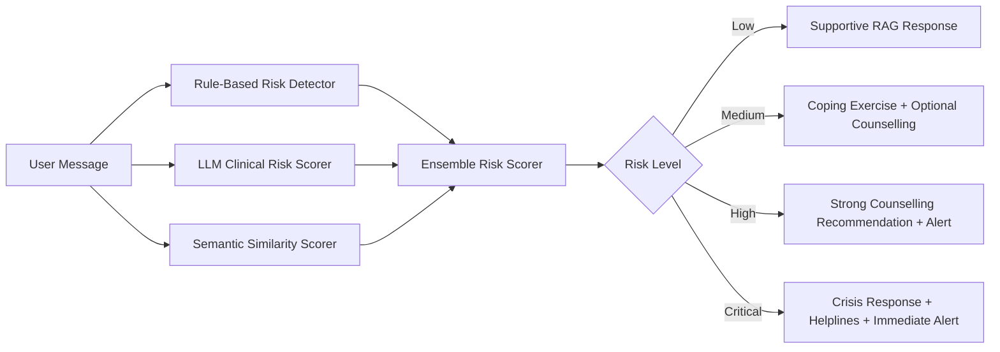

# Buddy Risk Pipeline Diagram

## Caption
Buddy evaluates each message using three independent signals and combines them using a conservative max ensemble. This design prioritizes safety by ensuring that any strong crisis signal can trigger intervention.
