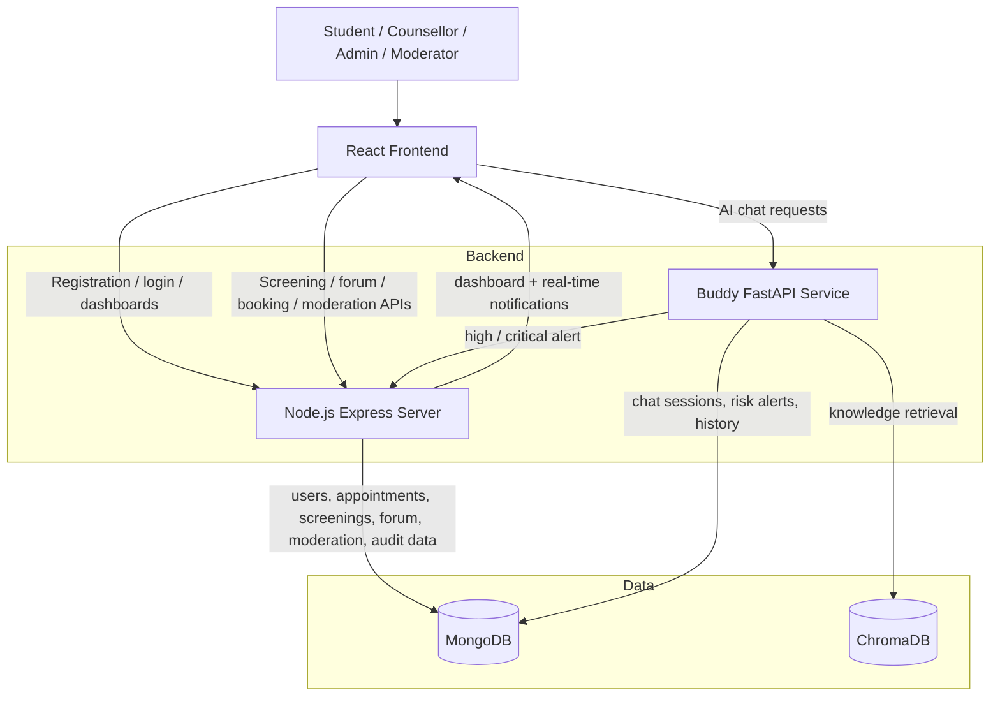

# Verified Mann-Mitra Architecture Diagram

## Caption
Mann-Mitra uses a React frontend, a Node.js backend for institutional platform services, and a Buddy FastAPI microservice for RAG-based mental health chat and multi-signal risk detection. MongoDB stores operational and chat data, while ChromaDB stores the knowledge base embeddings used for retrieval.

## Verified Workflow Notes
- Chat is handled by Buddy, not by the Node.js server as the primary frontend path.
- Screening, forum, booking, counsellor management, and role-based dashboards are handled by the Node.js backend.
- High-risk and critical-risk chat alerts are forwarded from Buddy to the Node.js server.
- Anonymous interaction exists mainly for peer/forum display and anonymized alert/dashboard identifiers, not as a fully anonymous system-wide registration model.
