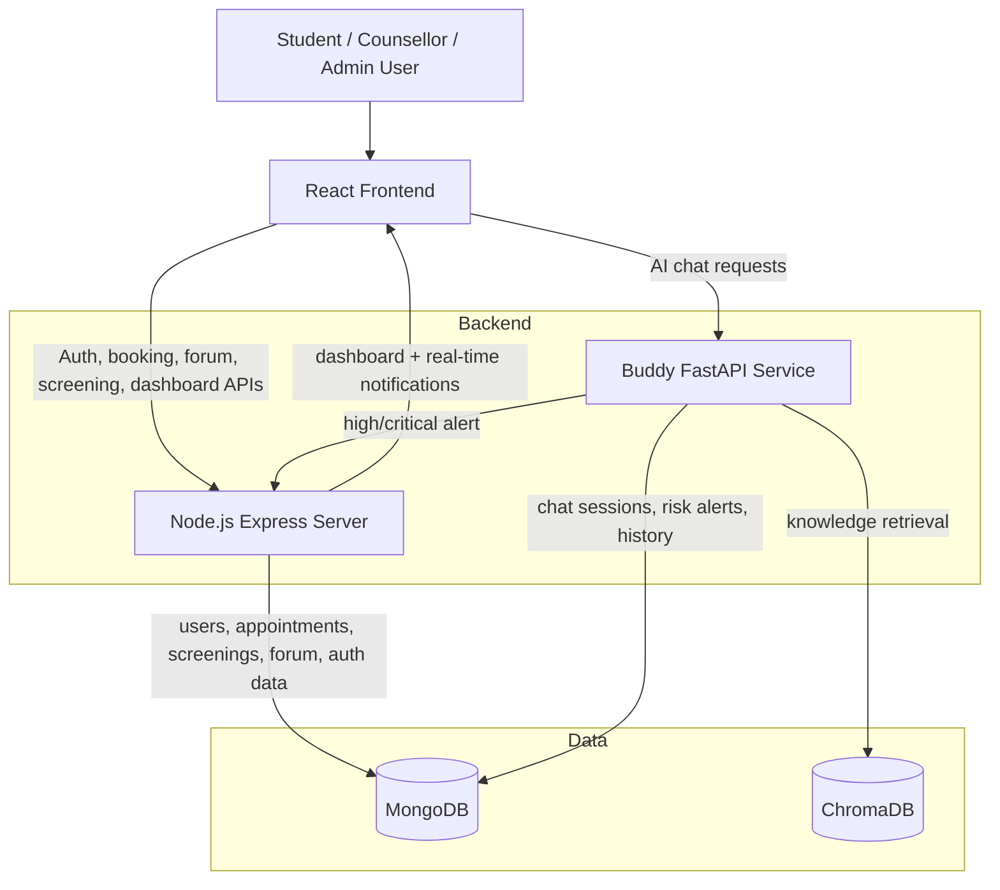

# Mann-Mitra Architecture Diagram

## Caption
Mann-Mitra uses a React frontend, a Node.js backend for institutional platform services, and a Buddy FastAPI microservice for RAG-based mental health chat and multi-signal risk detection. MongoDB stores operational and chat data, while ChromaDB stores the knowledge base embeddings used for retrieval.
