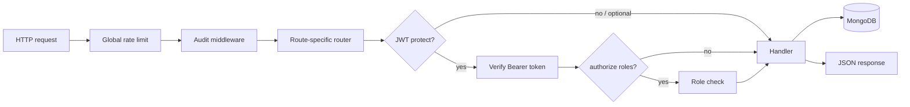

# Mann-Mitra API Server

Node.js **Express 5** application: **JWT authentication**, **role-based access**, **MongoDB** (Mongoose), **Socket.io**, **rate limiting**, and **audit** middleware for a mental health platform. It serves **students**, **counsellors**, **admins**, and **moderators** via `/api/v1` (with selected **legacy** aliases under `/api`).

---

## Requirements

- **Node.js** 18+ recommended  
- **MongoDB** (local or Atlas) — `MONGO_URI`

---

## Quick start

```bash
cd server
cp .env.example .env
# Edit .env — at minimum MONGO_URI, JWT_SECRET, CLIENT_URL
npm install
npm run dev
```

- **Port:** `PORT` from `.env`, default **5000**  
- **Health (no DB logic in handler):** `GET http://localhost:5000/health`  
- **API base:** `/api/v1/...`

---

## Environment variables

| Variable | Purpose |
|----------|---------|
| `MONGO_URI` | MongoDB connection string |
| `PORT` | HTTP port (default `5000`) |
| `JWT_SECRET` | Sign JWT access tokens |
| `JWT_EXPIRES_IN`, `JWT_COOKIE_EXPIRE` | Token lifetime |
| `CLIENT_URL` | Frontend origin for CORS-related configuration |
| `NODE_ENV` | `development` / `production` |
| `ENCRYPTION_KEY` | 64-char hex when encrypting fields (e.g. notes) |

See `.env.example` for optional LLM-related variables if you extend `llm.service`.

---

## NPM scripts

| Script | Description |
|--------|-------------|
| `npm run dev` | Nodemon |
| `npm start` | Node |
| `npm run lint` | ESLint |

---

## How routes are mounted (`src/index.js`)

| Mount path | Router | Notes |
|------------|--------|-------|
| `/api/v1/auth` | `auth.routes` | + `authRateLimit`, auth audit |
| `/api/auth` | same | **Legacy** alias |
| `/api/v1/chat` | `chat.routes` | Chat rate limits, crisis audit |
| `/api/v1/admin` | `admin.routes` | **Admin-only** (`protect` + `authorize('admin')`), admin audit |
| `/api/v1/screenings` | `screening.routes` | Sensitive rate limit, crisis audit |
| `/api/screening` | same | **Legacy** alias |
| `/api/v1/appointments` | `appointment.routes` | Bookings, status, admin/counsellor views |
| `/api/v1/counsellors` | `counsellor.routes` | Public directory of **active** counsellors (authenticated) |
| `/api/v1/forum` | `forum.routes` | Threads, posts, moderation |

Socket.io is initialized on the **same HTTP server** as Express (`services/socket.service.js`).

---

## Request lifecycle (flowchart)



---

## Authentication API (`/api/v1/auth`)

| Method | Path | Access | Description |
|--------|------|--------|-------------|
| `GET` | `/organizations` | Public | Organization keys / listing for registration |
| `POST` | `/register` | Public | **Student** registration (validated; organization key, member id, etc.) |
| `POST` | `/login` | Public | **Student** login |
| `POST` | `/admin/signup` | Public | **Admin** signup (org name, department, strong password, …) |
| `POST` | `/admin/login` | Public | **Admin** login |
| `POST` | `/counsellor/login` | Public | **Counsellor** login |
| `POST` | `/logout` | Private | Invalidate / clear session (with token) |
| `GET` | `/me` | Private | Current user |
| `PUT` | `/me` | Private | Update profile |

> Tokens are returned on successful login/register; client sends `Authorization: Bearer <token>`.

---

## Appointments (`/api/v1/appointments`)

Core flows for **students** booking **counsellors**; **counsellors** and **admins** can list/manage where authorized.

| Method | Path | Access | Description |
|--------|------|--------|-------------|
| `POST` | `/` | Private | Create appointment (validated body: `counsellorId`, `slotStart`/`slotEnd`, `mode`, …) |
| `GET` | `/me` | Private | Current user’s appointments |
| `GET` | `/counsellor/:counsellorId/availability` | Private | Availability for booking UI |
| `GET` | `/:id` | Private | Single appointment |
| `PATCH` | `/:id/status` | Private | Update status (`requested`, `confirmed`, `cancelled`, `completed`, `no-show`, …) |
| `GET` | `/admin/all` | **admin**, **counsellor** | Filtered list (e.g. by `counsellorId` for admin detail modals) |
| `GET` | `/admin/stats` | **admin**, **counsellor** | Aggregated stats |
| `PATCH` | `/admin/bulk-update` | **admin** | Bulk status updates |

---

## Counsellor directory (`/api/v1/counsellors`)

Read-only listing for the **student** booking experience (only **`isActive`** counsellors).

| Method | Path | Access | Description |
|--------|------|--------|-------------|
| `GET` | `/` | Private | Paginated list, optional `specialization` filter |
| `GET` | `/:id` | Private | Profile + availability-style data |

> **Admin** create/update/delete lives under **`/api/v1/admin/counsellors`** (see below).

---

## Screenings (`/api/v1/screenings`)

Mental health screening tools (**PHQ-9**, **GAD-7**).

| Method | Path | Access | Description |
|--------|------|--------|-------------|
| `POST` | `/` | Optional auth | Submit screening (`optionalAuth` allows anonymous) |
| `GET` | `/my-history` | Private | Authenticated user history |
| `GET` | `/:id` | Private | Single screening |
| `GET` | `/high-risk` | **counsellor**, **admin**, **moderator** | High-risk list for follow-up |

(Legacy mount: `/api/screening`.)

---

## Forum (`/api/v1/forum`)

| Method | Path | Access | Description |
|--------|------|--------|-------------|
| `GET` | `/threads` | Public | Threads with filters (tag, language, search, sort, …) |
| `POST` | `/posts` | Optional auth | Create post |
| `GET` | `/posts/:id` | Public | Post + replies |
| `PATCH` | `/posts/:id/moderate` | **admin**, **moderator** | Change moderation status |
| `POST` | `/posts/:id/like` | Private | Toggle like |
| `POST` | `/posts/:id/report` | Private | Report post |
| `GET` | `/moderation/queue` | **admin**, **moderator** | Moderation queue |
| `GET` | `/tags` | Public | Popular tags |
| `GET` | `/stats` | Public | Forum stats |

---

## Chat HTTP API (`/api/v1/chat`)

Supports **optional authentication** on message send for anonymous crisis use cases; history and analytics are stricter.

| Method | Path | Access | Description |
|--------|------|--------|-------------|
| `POST` | `/message` | Optional auth | AI mental health first-aid style reply via **`llm.service`** (safety checks, logging) |
| `GET` | `/history/:sessionId` | Private | Session history |
| … | (additional routes) | See `chat.routes.js` | Analytics, appointment-linked messages, etc. |

> The **React `Chat` page** often uses **Buddy** directly; this route is the **Node**-side alternative/integration point.

---

## Admin API (`/api/v1/admin`)

All routes use **`protect`** + **`authorize('admin')`** unless noted.

**Dashboard & analytics (examples)**

| Method | Path | Description |
|--------|------|---------------|
| `GET` | `/overview` | Dashboard KPIs |
| `GET` | `/users/analytics` | User analytics (`period` query) |
| `GET` | `/crisis/dashboard` | Crisis dashboard |
| `GET` | `/system/health` | DB + process metrics |
| `GET` | `/reports/export` | Export reports (`type`, `format`, dates) |

**Counsellor management** (matches admin UI: View / Edit / Deactivate / Delete)

| Method | Path | Description |
|--------|------|-------------|
| `GET` | `/counsellors` | List (pagination/filters) |
| `POST` | `/counsellors` | Create counsellor |
| `GET` | `/counsellors/:id` | Detail |
| `PUT` | `/counsellors/:id` | Update fields |
| `PATCH` | `/counsellors/:id/status` | Body `{ "isActive": boolean }` |
| `DELETE` | `/counsellors/:id` | Soft delete (`isActive: false`); **blocked** if counsellor has **requested** or **confirmed** appointments |
| `POST` | `/counsellors/:id/reset-password` | Reset password (sensitive rate limit) |

---

## Roles in the data model

Users carry a **`role`** field (e.g. `student`, `counsellor`, `admin`, `moderator`). Middleware **`authorize(...roles)`** restricts handlers. Always align new routes with the same pattern.

---

## Security features

- **Helmet** headers  
- **Rate limiting** (global + per-route; sensitive operations stricter)  
- **Audit** middleware on API traffic (`/api/`)  
- JWT verification on protected routes  

---

## Project structure

```
server/
├── src/
│   ├── index.js           # Entry: middleware, mounts, Mongo, Socket.io
│   ├── controllers/
│   ├── routes/
│   ├── models/
│   ├── middlewares/       # auth, rateLimit, audit
│   └── services/          # socket, llm, …
├── api/                   # Optional serverless entry (e.g. Vercel)
├── .env.example
└── package.json
```

---

## Troubleshooting

| Issue | What to check |
|-------|----------------|
| Process exits on boot | `MONGO_URI`, network, MongoDB running |
| 401 Unauthorized | Expired/missing JWT; correct auth header |
| 403 Forbidden | User `role` does not match `authorize()` |
| Cannot delete counsellor | Active appointments with status **requested** or **confirmed** |
| CORS in browser | Origin vs `cors()` / `CLIENT_URL`; dev often wide-open |

---

## Related documentation

- **[../README.md](../README.md)** — full platform architecture and flowcharts  
- **[../client/README.md](../client/README.md)** — which pages call which endpoints  
- **[../buddy/README.md](../buddy/README.md)** — Buddy service (RAG chat, Mongo, Chroma)  
